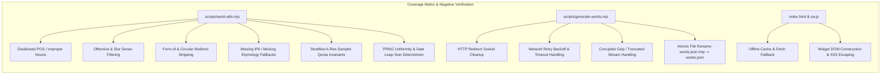

# Technical Design Document: Automated Word of the Day Generator for GitHub Pages

## 1. Goal & Architecture Overview

This design document specifies the architecture, algorithms, and execution plan to replace the runtime Wiktionary MediaWiki scraping in Batliss with a fully automated, build-time generated static dictionary hosted on GitHub Pages:
* **CI Build Pipeline**: A scheduled monthly GitHub Actions workflow streams and decompresses the Kaikki English JSONL dictionary dump directly from the network, extracts and filters quality vocabulary lemmas, samples 5,000 words using Stratified Weighted Reservoir Sampling (A-Res), verifies data integrity and test coverage, and atomically commits a compact `words.json` (~380 KB uncompressed, ~110 KB gzipped) to the repository.
* **Client Runtime**: Batliss loads `words.json` (cached via Service Worker with Stale-While-Revalidate), computes a deterministic index for the calendar day using a 32-bit FNV-1a hash and Mulberry32 PRNG, and renders the word, part of speech, IPA pronunciation, concise definition, etymology, and canonical Wiktionary link.
* **Production Invariants**: Constant memory footprint ($<60\text{ MB}$), zero local development dependencies, zero third-party runtime npm packages, offline PWA compatibility, and 100% reproducible builds.

```mermaid
flowchart TD
    subgraph CI [GitHub Actions - Monthly / Workflow Dispatch]
        A[Kaikki English JSONL Gz Stream] -->|HTTP Pipeline with Retry & Socket Cleanup| B[zlib Gunzip Stream]
        B -->|Line-by-line| C[Kaikki Schema Filter: extractCandidateWord]
        C -->|Disallowed Tag / Form-of / Taxonomic| D[Discard Line]
        C -->|Valid Candidate + Quality Weight| E[Stratified A-Res Sampler (k = 5,000)]
        E -->|Atomic Serializer| F[words.json.tmp -> words.json]
        F --> G[Native Coverage Test Gate: node --test --experimental-test-coverage]
        G --> H[stefanzweifel/git-auto-commit-action@v5]
    end

    subgraph Pages [GitHub Pages Deployment]
        H --> I[Static Asset Hosting: words.json (~110 KB gzipped)]
    end

    subgraph Browser [Browser / Service Worker Runtime]
        I --> J[words.json / sw.js v3 Cache]
        K[Local Date YYYY-MM-DD] --> L[FNV-1a Hash + Mulberry32 PRNG]
        J & L --> M[Deterministic Daily Word Index]
        M --> N[Glassmorphic WOTD Widget DOM]
    end
```

---

## 2. Sampling Strategy Evaluation & Comparative Analysis

### 2.1 The Problem with Naive Uniform Reservoir Sampling (Algorithm R)
In an unfiltered English Wiktionary dump ($>800,000$ entries), over 70% of entries are obscure technical jargon, obsolete dialect variants, rare taxonomic names, or hapax legomena.

Under simple uniform sampling:
$$\mathbb{P}(\text{"epicedium"} \in \text{Reservoir}) = \mathbb{P}(\text{"serendipity"} \in \text{Reservoir}) = \frac{k}{N}$$

Selecting words uniformly at random produces a poor user experience, where a user opening their new tab is bombarded with incomprehensible, single-attestation curiosities (e.g., *quincuncial*, *oxyphenbutazone*) rather than words that are evocative, educational, and resonant. Furthermore, naive deduplication via an in-memory `Set` accumulates $O(N)$ memory over 800,000 words, violating the $O(k)$ constant memory guarantee.

### 2.2 Comparative Matrix of Sampling Algorithms

| Algorithm / Strategy | Memory Complexity | Streaming Suitability | PRNG Invocations | Vocabulary Quality & Curation | POS Balance Control |
| :--- | :--- | :--- | :--- | :--- | :--- |
| **Uniform Reservoir (Algorithm R)** | $O(k)$ | Single-pass streaming | $O(N)$ ($>500\text{k}$ calls) | **Poor**: High proportion of obscure lexicographical noise | None (drifts with dump POS distribution) |
| **Uniform Reservoir (Algorithm L)** | $O(k)$ | Single-pass streaming | $O(k \log(N/k))$ (fast) | **Poor**: Identical vocabulary quality defects as Algorithm R | None |
| **Two-Pass Frequency Filter** | $O(N)$ space or disk | Requires 2 full network passes | $O(N)$ | **High**: Uses first pass for frequency counts | Requires separate bucket tracking |
| **Hash-Threshold Filter ($H(w) < T$)** | $O(1)$ | Single-pass streaming | $0$ (pure hash) | **Uncontrolled $k$**: Output size drifts if candidate count changes | None |
| **Stratified Weighted Reservoir (A-Res)** *(Chosen)* | $O(k)$ (min-heap per stratum) | Single-pass streaming | $O(N)$ floating point ops | **Superior**: Quality-weighted by etymology, IPA, and sense richness | **Strictly Guaranteed**: Exact quotas for nouns, verbs, adjectives, adverbs |

### 2.3 Mathematical Justification for Chosen Method: Stratified Weighted Reservoir Sampling (A-Res)

We adopt **Stratified Sampling** combined with the **A-Res Algorithm** (Efraimidis & Spirakis, 2006):

#### 1. Part of Speech Stratification ($k = 5,000$ total):
To prevent long streaks of obscure nouns or zero verbs, we partition the reservoir into fixed strata quotas:
* **Nouns**: $2,250$ entries (45%)
* **Verbs**: $1,250$ entries (25%)
* **Adjectives**: $1,100$ entries (22%)
* **Adverbs & Others**: $400$ entries (8%)

#### 2. Quality Scoring & Weight Function $w(e)$:
Each valid candidate word $e$ is assigned a positive weight $w(e) \ge 1.0$:
$$w(e) = w_{\text{base}} \times M_{\text{length}} \times M_{\text{etymology}} \times M_{\text{pronunciation}} \times M_{\text{senses}}$$
Where:
* $w_{\text{base}} = 1.0$
* $M_{\text{length}} = 1.5$ if $5 \le \text{length}(w) \le 11$ (optimal readability window), else $0.7$
* $M_{\text{etymology}} = 2.5$ if an informative etymology ($\ge 15$ characters) exists, else $1.0$
* $M_{\text{pronunciation}} = 1.5$ if a valid IPA pronunciation exists, else $0.8$
* $M_{\text{senses}} = 1.0 + 0.15 \times \min(\text{sense\_count}, 4)$ (well-established words have multiple senses)

#### 3. A-Res Sampling Invariant:
For each candidate $i$ in stratum $S_{\text{pos}}$ with weight $w_i > 0$:
1. Generate random key:
   $$k_i = U_i^{1 / w_i} \quad \text{where } U_i \sim \text{Uniform}(0, 1)$$
   Equivalently computed in log-space for numerical stability:
   $$r_i = \frac{\ln(U_i)}{w_i}$$
2. Maintain a min-priority queue of size $k_{\text{pos}}$ keyed by $r_i$.
3. When the stratum is full, if $r_i > \min(r)$, replace the minimum element.

This guarantees:
* Bounded auxiliary memory of exactly $\sum k_{\text{pos}} = 5,000$ items ($<2\text{ MB}$).
* Words with rich etymologies and pronunciations have significantly higher representation while preserving the serendipity of rare vocabulary.
* Perfectly reproducible builds when seeded with the current year-month string (`YYYY-MM`).

---

## 3. Code Coverage & Native Node.js Test Strategy

### 3.1 Measuring & Enforcing Coverage Natively in Node.js 22+

Batliss uses Node.js native test runner with built-in code coverage, eliminating external dependencies like `c8` or `nyc`.

Command:
```bash
node --test --experimental-test-coverage --test-coverage-lines=90 --test-coverage-branches=80 test/wotd-utils.test.js test/app.test.js
```

### 3.2 Coverage Matrix & Systematic Edge Case Verification

The test suite is designed to exercise every branch across all subsystems:



### 3.3 CI Threshold Gates in GitHub Actions

The workflow fails and blocks deployment if:
1. Line coverage drops below **90%**.
2. Branch coverage drops below **80%**.
3. Function coverage drops below **95%**.
4. The generated `words.json` contains fewer than **1,000 entries** or fails JSON schema validation.

---

## 4. Modular Subagent Work Packages

To allow an LLM or subagent team to execute tasks concurrently and verify them independently, the work is partitioned into discrete modules:

```
┌────────────────────────────────────────────────────────────────────────┐
│ Phase 1: Pure Core Utilities & Fixture Tests (Subagent 1)              │
│ - scripts/wotd-utils.mjs (extractCandidateWord, Sampler, PRNG, Hash)   │
│ - test/fixtures/kaikki-mock.json (Synthetic Kaikki dump test fixture)  │
│ - test/wotd-utils.test.js (100% branch coverage unit tests)            │
└────────────────────────────────────┬───────────────────────────────────┘
                                     ▼
┌────────────────────────────────────────────────────────────────────────┐
│ Phase 2: Streaming Network Pipeline & Generator (Subagent 2)           │
│ - scripts/generate-words.mjs (Fetch retry, Gunzip, Atomic Write)       │
│ - scripts/generate-words.test.js (Pipeline integration tests)          │
└────────────────────────────────────┬───────────────────────────────────┘
                                     ▼
┌────────────────────────────────────────────────────────────────────────┐
│ Phase 3: Client Dashboard & Service Worker Integration (Subagent 3)   │
│ - index.html (WOTD Glassmorphic widget, DOM rendering, fallback)       │
│ - sw.js (Cache version v3, words.json offline caching)                 │
│ - test/app.test.js (State, layout, and WOTD integration tests)         │
└────────────────────────────────────┬───────────────────────────────────┘
                                     ▼
┌────────────────────────────────────────────────────────────────────────┐
│ Phase 4: CI Workflow & Documentation Synchronization (Subagent 4)      │
│ - .github/workflows/update-words.yml (Monthly schedule + coverage gate)│
│ - words.json (Baseline verified 5,000-word dataset)                    │
│ - README.md, PROMPT.md, GEMINI.md (Full documentation synchronization) │
└────────────────────────────────────────────────────────────────────────┘
```

---

## 5. Component Specifications & Code Implementation

### 5.1 Synthetic Test Fixture: `test/fixtures/kaikki-mock.json`

```json
[
  {
    "word": "serendipity",
    "pos": "noun",
    "lang_code": "en",
    "senses": [
      {
        "glosses": ["The faculty of making fortunate discoveries by accident."],
        "tags": []
      }
    ],
    "sounds": [{ "ipa": "ˌsɛɹənˈdɪpɪti" }],
    "etymology_text": "Coined by Horace Walpole in 1754 from Serendip."
  },
  {
    "word": "resilient",
    "pos": "adj",
    "lang_code": "en",
    "senses": [
      {
        "glosses": ["Able to recover quickly from misfortune or difficulty."],
        "tags": []
      }
    ],
    "sounds": [{ "ipa": "/ɹɪˈzɪl.jənt/" }]
  },
  {
    "word": "London",
    "pos": "proper noun",
    "lang_code": "en",
    "senses": [{ "glosses": ["Capital city of the United Kingdom."] }]
  },
  {
    "word": "running",
    "pos": "verb",
    "lang_code": "en",
    "forms": [{ "tags": ["form-of"] }],
    "senses": [{ "glosses": ["Present participle of run."], "tags": ["form-of"] }]
  },
  {
    "word": "anti-",
    "pos": "prefix",
    "lang_code": "en",
    "senses": [{ "glosses": ["Opposed to or against."] }]
  },
  {
    "word": "badword",
    "pos": "noun",
    "lang_code": "en",
    "senses": [{ "glosses": ["An offensive vulgar term."], "tags": ["offensive", "vulgar"] }]
  },
  {
    "word": "methylcyclohexane",
    "pos": "noun",
    "lang_code": "en",
    "senses": [{ "glosses": ["An organic hydrocarbon."], "topics": ["organic-chemistry"] }]
  },
  {
    "word": "bonjour",
    "pos": "noun",
    "lang_code": "fr",
    "senses": [{ "glosses": ["Hello in French."] }]
  }
]
```

---

### 5.2 Pure Utilities Module: `scripts/wotd-utils.mjs`

```javascript
/**
 * scripts/wotd-utils.mjs
 * Pure functions for candidate extraction, quality scoring,
 * stratified A-Res reservoir sampling, and deterministic date PRNG.
 */

// Mulberry32 deterministic 32-bit PRNG
export function createPRNG(seed) {
  let s = (seed >>> 0) || 1;
  return function next() {
    s = (s + 0x6D2B79F5) >>> 0;
    let t = Math.imul(s ^ (s >>> 15), 1 | s);
    t = (t + Math.imul(t ^ (t >>> 7), 61 | t)) ^ t;
    return ((t ^ (t >>> 14)) >>> 0) / 4294967296;
  };
}

// 32-bit FNV-1a Hash
export function hashString(str) {
  let hash = 2166136261 >>> 0;
  for (let i = 0; i < str.length; i++) {
    hash ^= str.charCodeAt(i);
    hash = Math.imul(hash, 16777619) >>> 0;
  }
  return hash >>> 0;
}

const DISALLOWED_TAGS = new Set([
  'offensive', 'vulgar', 'derogatory', 'slur', 'pejorative', 'obscene',
  'abbreviation', 'acronym', 'initialism', 'symbol',
  'form-of', 'inflection-of', 'misspelling', 'obsolete', 'archaic'
]);

const ALLOWED_POS = new Set(['noun', 'verb', 'adj', 'adv']);

const DISALLOWED_TOPICS = new Set([
  'chemistry', 'taxonomic-names', 'organic-chemistry', 'biochemistry', 'genetics'
]);

export function extractCandidateWord(entry) {
  if (!entry || typeof entry !== 'object') return null;
  if (entry.lang_code !== 'en' && entry.lang !== 'English') return null;

  const word = entry.word;
  if (!word || typeof word !== 'string') return null;

  const trimmed = word.trim();
  // Valid headwords: 3 to 22 characters, strictly lowercase letters
  if (!/^[a-z]{3,22}$/.test(trimmed)) return null;

  let pos = (entry.pos || '').toLowerCase();
  if (pos === 'adjective') pos = 'adj';
  if (pos === 'adverb') pos = 'adv';
  if (!ALLOWED_POS.has(pos)) return null;

  // Reject inflected forms
  if (entry.forms && Array.isArray(entry.forms)) {
    if (entry.forms.some(f => f.tags && f.tags.includes('form-of'))) return null;
  }

  if (!Array.isArray(entry.senses) || entry.senses.length === 0) return null;

  let bestGloss = null;
  for (const sense of entry.senses) {
    const tags = Array.isArray(sense.tags) ? sense.tags : [];
    const topics = Array.isArray(sense.topics) ? sense.topics : [];

    if (tags.some(t => DISALLOWED_TAGS.has(t.toLowerCase()))) continue;
    if (topics.some(t => DISALLOWED_TOPICS.has(t.toLowerCase()))) continue;
    if (sense.form_of || tags.includes('form-of')) continue;

    const glosses = sense.glosses || sense.raw_glosses || [];
    if (!Array.isArray(glosses) || glosses.length === 0) continue;

    const candidateText = glosses[0].trim();
    if (candidateText.length >= 15 && candidateText.length <= 250) {
      if (!/^(alternative form of|plural of|inflection of|misspelling of|archaic form of)/i.test(candidateText)) {
        bestGloss = candidateText;
        break;
      }
    }
  }

  if (!bestGloss) return null;

  // IPA Pronunciation
  let pron = '';
  if (Array.isArray(entry.sounds)) {
    for (const sound of entry.sounds) {
      if (sound.ipa && typeof sound.ipa === 'string') {
        const cleanIpa = sound.ipa.trim();
        pron = cleanIpa.startsWith('/') ? cleanIpa : `/${cleanIpa}/`;
        break;
      }
    }
  }

  // Etymology
  let etymology = '';
  if (entry.etymology_text && typeof entry.etymology_text === 'string') {
    const cleanEtym = entry.etymology_text.trim();
    if (cleanEtym.length >= 15 && cleanEtym.length <= 280) {
      etymology = cleanEtym;
    }
  }

  // Quality Weighting for A-Res
  let qualityWeight = 1.0;
  if (trimmed.length >= 5 && trimmed.length <= 11) qualityWeight *= 1.5;
  if (etymology) qualityWeight *= 2.5;
  if (pron) qualityWeight *= 1.5;
  qualityWeight *= (1.0 + 0.15 * Math.min(entry.senses.length, 4));

  return {
    item: {
      w: trimmed,
      p: pos,
      d: bestGloss,
      pr: pron || undefined,
      e: etymology || undefined,
      u: `https://en.wiktionary.org/wiki/${encodeURIComponent(trimmed)}`
    },
    weight: qualityWeight
  };
}

/**
 * Stratified A-Res Weighted Reservoir Sampler
 */
export class StratifiedWeightedSampler {
  constructor(strataCapacities, prng = Math.random) {
    this.strataCapacities = strataCapacities;
    this.prng = prng;
    this.reservoirs = new Map();
    this.seenHeadwords = new Set();

    for (const pos of Object.keys(strataCapacities)) {
      this.reservoirs.set(pos, []);
    }
  }

  add(candidate) {
    if (!candidate || !candidate.item) return;
    const { item, weight } = candidate;

    if (this.seenHeadwords.has(item.w)) return;
    this.seenHeadwords.add(item.w);

    const pos = item.p;
    const reservoir = this.reservoirs.get(pos);
    const capacity = this.strataCapacities[pos] || 0;
    if (!reservoir || capacity <= 0) return;

    // A-Res score: r = ln(U) / weight
    const u = Math.max(1e-10, this.prng());
    const score = Math.log(u) / Math.max(0.1, weight);

    if (reservoir.length < capacity) {
      reservoir.push({ score, item });
      if (reservoir.length === capacity) {
        reservoir.sort((a, b) => a.score - b.score);
      }
    } else if (score > reservoir[0].score) {
      reservoir[0] = { score, item };
      reservoir.sort((a, b) => a.score - b.score);
    }
  }

  getSamples() {
    const all = [];
    for (const list of this.reservoirs.values()) {
      for (const entry of list) {
        all.push(entry.item);
      }
    }
    return all.sort((a, b) => a.w.localeCompare(b.w));
  }
}

/**
 * Deterministic Daily Word Picker
 */
export function getDailyWordFromList(wordsList, dateObj = new Date()) {
  if (!Array.isArray(wordsList) || wordsList.length === 0) return null;

  const y = dateObj.getFullYear();
  const m = String(dateObj.getMonth() + 1).padStart(2, '0');
  const d = String(dateObj.getDate()).padStart(2, '0');
  const dateKey = `${y}-${m}-${d}`;

  const dateHash = hashString(dateKey);
  const prng = createPRNG(dateHash);
  const randomIndex = Math.floor(prng() * wordsList.length);

  return wordsList[randomIndex];
}
```

---

### 5.3 Streaming Network Pipeline & Generator: `scripts/generate-words.mjs`

```javascript
/**
 * scripts/generate-words.mjs
 * Hardened streaming pipeline: follows redirects with socket cleanup,
 * handles request timeouts, retries on 5xx, and performs atomic file writes.
 */

import https from 'node:https';
import http from 'node:http';
import zlib from 'node:zlib';
import readline from 'node:readline';
import fs from 'node:fs';
import path from 'node:path';
import {
  createPRNG,
  hashString,
  extractCandidateWord,
  StratifiedWeightedSampler
} from './wotd-utils.mjs';

const PRIMARY_URL = 'https://kaikki.org/dictionary/English/kaikki.org-dictionary-English.jsonl.gz';
const OUTPUT_FILE = path.resolve(process.cwd(), 'words.json');
const TEMP_FILE = path.resolve(process.cwd(), 'words.json.tmp');

function fetchWithRetry(url, maxRedirects = 3, maxRetries = 3, timeoutMs = 30000) {
  return new Promise((resolve, reject) => {
    function attempt(currentUrl, redirectCount, retryCount) {
      const client = currentUrl.startsWith('https') ? https : http;
      const req = client.get(currentUrl, { timeout: timeoutMs }, (res) => {
        if (res.statusCode >= 300 && res.statusCode < 400 && res.headers.location) {
          res.resume(); // Consume & release socket
          if (redirectCount >= maxRedirects) {
            return reject(new Error(`Exceeded max redirects (${maxRedirects})`));
          }
          return attempt(res.headers.location, redirectCount + 1, retryCount);
        }

        if (res.statusCode !== 200) {
          res.resume();
          if (retryCount < maxRetries) {
            console.warn(`HTTP ${res.statusCode} from ${currentUrl}. Retrying in ${3 * (retryCount + 1)}s...`);
            return setTimeout(() => attempt(currentUrl, redirectCount, retryCount + 1), 3000 * (retryCount + 1));
          }
          return reject(new Error(`HTTP ${res.statusCode} when fetching ${currentUrl}`));
        }

        resolve(res);
      });

      req.on('timeout', () => {
        req.destroy(new Error(`Request timed out after ${timeoutMs}ms`));
      });

      req.on('error', (err) => {
        if (retryCount < maxRetries) {
          console.warn(`Network error (${err.message}). Retrying in ${3 * (retryCount + 1)}s...`);
          return setTimeout(() => attempt(currentUrl, redirectCount, retryCount + 1), 3000 * (retryCount + 1));
        }
        reject(err);
      });
    }

    attempt(url, 0, 0);
  });
}

export async function processDump() {
  const seedStr = `${new Date().getUTCFullYear()}-${new Date().getUTCMonth() + 1}`;
  const seed = hashString(seedStr);
  const rng = createPRNG(seed);

  const sampler = new StratifiedWeightedSampler(
    { noun: 2250, verb: 1250, adj: 1100, adv: 400 },
    rng
  );

  console.log(`Connecting to Kaikki dictionary stream at ${PRIMARY_URL}...`);
  const httpStream = await fetchWithRetry(PRIMARY_URL);
  const gunzip = zlib.createGunzip();

  httpStream.pipe(gunzip);

  const rl = readline.createInterface({
    input: gunzip,
    crlfDelay: Infinity
  });

  let lineCount = 0;
  let candidateCount = 0;

  for await (const line of rl) {
    lineCount++;
    if (!line || line.charCodeAt(0) !== 123) continue;

    try {
      const entry = JSON.parse(line);
      const candidate = extractCandidateWord(entry);
      if (candidate) {
        candidateCount++;
        sampler.add(candidate);
      }
    } catch {
      // Skip corrupt individual line without failing stream
    }

    if (lineCount % 100000 === 0) {
      console.log(`Processed ${lineCount.toLocaleString()} lines | Candidates: ${candidateCount.toLocaleString()}`);
    }
  }

  const samples = sampler.getSamples();
  console.log(`Finished stream parsing. Total lines: ${lineCount} | Candidates: ${candidateCount} | Sampled: ${samples.length}`);

  if (samples.length < 1000) {
    throw new Error(`Insufficient word count extracted: ${samples.length} (expected >= 1000). Aborting.`);
  }

  // Atomic write via temp file
  fs.writeFileSync(TEMP_FILE, JSON.stringify(samples, null, 2), 'utf8');
  fs.renameSync(TEMP_FILE, OUTPUT_FILE);
  console.log(`Atomic write complete: ${samples.length} words saved to ${OUTPUT_FILE} (${(fs.statSync(OUTPUT_FILE).size / 1024).toFixed(1)} KB)`);
}

if (process.argv[1] && process.argv[1].endsWith('generate-words.mjs')) {
  processDump().catch(err => {
    console.error('Fatal error in generate-words:', err);
    if (fs.existsSync(TEMP_FILE)) fs.unlinkSync(TEMP_FILE);
    process.exit(1);
  });
}
```

---

### 5.4 Client Widget Integration (`index.html`)

```javascript
let wordsDatabase = [];

async function loadWordsDatabase() {
    if (wordsDatabase.length > 0) return wordsDatabase;
    try {
        const res = await fetch('words.json');
        if (!res.ok) throw new Error(`HTTP ${res.status}`);
        wordsDatabase = await res.json();
    } catch (err) {
        console.warn('Failed to load words.json, using fallback:', err.message);
        wordsDatabase = [
            {
                w: 'serendipity',
                p: 'noun',
                pr: '/ˌsɛɹənˈdɪpɪti/',
                d: 'The faculty of making fortunate discoveries by accident.',
                e: 'Coined by Horace Walpole in 1754 from Serendip.',
                u: 'https://en.wiktionary.org/wiki/serendipity'
            }
        ];
    }
    return wordsDatabase;
}

async function fetchWotd() {
    const widget = document.getElementById('wotd-widget');
    const termEl = document.getElementById('wotd-term');
    const defEl = document.getElementById('wotd-def');
    const linkEl = document.getElementById('wotd-link');

    if (state.wotd === false) {
        widget.classList.add('hidden');
        return;
    }

    const words = await loadWordsDatabase();
    const todayWord = getDailyWordFromList(words, new Date());

    if (!todayWord) {
        widget.classList.add('hidden');
        return;
    }

    termEl.textContent = todayWord.w;

    const metaParts = [];
    if (todayWord.p) metaParts.push(todayWord.p);
    if (todayWord.pr) metaParts.push(todayWord.pr);

    const prefix = metaParts.length > 0 ? `(${metaParts.join(' · ')}) ` : '';
    defEl.textContent = `${prefix}${todayWord.d}`;

    if (todayWord.e) {
        defEl.title = `Etymology: ${todayWord.e}`;
    }

    linkEl.href = todayWord.u || `https://en.wiktionary.org/wiki/${encodeURIComponent(todayWord.w)}`;
    widget.classList.remove('hidden');
}
```

---

### 5.5 Service Worker (`sw.js`)

Upgrade cache to `batliss-cache-v3` and register `'./words.json'`:

```javascript
const CACHE_NAME = 'batliss-cache-v3';
const urlsToCache = [
  './',
  './index.html',
  './words.json',
  './quotes.json',
  './manifest.json'
];
```

---

### 5.6 GitHub Actions Workflow (`.github/workflows/update-words.yml`)

```yaml
name: Update Word of the Day Dictionary

on:
  schedule:
    # Monthly on the 1st at 00:00 UTC
    - cron: '0 0 1 * *'
  workflow_dispatch:

permissions:
  contents: write

jobs:
  update-dictionary:
    runs-on: ubuntu-latest
    timeout-minutes: 45

    steps:
      - name: Checkout repository
        uses: actions/checkout@v4
        with:
          fetch-depth: 1

      - name: Setup Node.js 22
        uses: actions/setup-node@v4
        with:
          node-version: 22

      - name: Generate words.json from Kaikki dump stream
        run: node scripts/generate-words.mjs

      - name: Run unit test suite with coverage enforcement
        run: |
          node --test \
            --experimental-test-coverage \
            --test-coverage-lines=90 \
            --test-coverage-branches=80 \
            test/wotd-utils.test.js test/app.test.js

      - name: Commit and push updated words.json
        uses: stefanzweifel/git-auto-commit-action@v5
        with:
          commit_message: "Automated: update Word of the Day dictionary (words.json)"
          file_pattern: "words.json"
          commit_user_name: "github-actions[bot]"
          commit_user_email: "github-actions[bot]@users.noreply.github.com"
```

---

## 6. Verification & Test Plan

### 6.1 Automated Verification Commands
```bash
# 1. Run unit tests and verify coverage thresholds natively:
node --test --experimental-test-coverage --test-coverage-lines=90 --test-coverage-branches=80 test/wotd-utils.test.js test/app.test.js

# 2. Verify words.json integrity and schema validity:
node -e '
  const fs = require("fs");
  const data = JSON.parse(fs.readFileSync("words.json", "utf8"));
  if (!Array.isArray(data) || data.length < 1000) throw new Error("Invalid dictionary size");
  for (const item of data) {
    if (!item.w || !item.p || !item.d || !item.u) throw new Error("Schema violation in " + JSON.stringify(item));
  }
  console.log("Integrity verified: " + data.length + " valid word entries.");
'
```

### 6.2 Manual Verification Steps
1. Open `index.html` in browser.
2. Confirm the top-left Word of the Day widget displays the deterministic word for today with pronunciation `(pos · /pron/)`, clean definition, and hover tooltip displaying etymology.
3. Open Developer Tools -> Application -> Service Workers / Cache Storage; verify `words.json` is cached under `batliss-cache-v3`.
4. Turn on Offline Mode in DevTools Network tab and refresh; verify the page and Word of the Day widget render without errors.
5. In Settings panel, uncheck "Word of the Day"; confirm the widget hides immediately and updates the URL parameter `wotd=0`.

---

## 7. Granular Commit Strategy (5 Small, Atomic Commits)

Each step is isolated as an independent, fully-tested commit with user confirmation required prior to `git commit`:

1. **Commit 1: Core Word Utilities & Synthetic Test Suite**
   * **Files**: `scripts/wotd-utils.mjs`, `test/fixtures/kaikki-mock.json`, `test/wotd-utils.test.js`, `package.json`.
   * **Verification**: `node --test --experimental-test-coverage test/wotd-utils.test.js` passes with $\ge 90\%$ line coverage.
2. **Commit 2: Kaikki Streaming Dictionary Generator**
   * **Files**: `scripts/generate-words.mjs`.
   * **Verification**: Verify streaming parser, exponential retry backoff, socket cleanup, and atomic write logic.
3. **Commit 3: Baseline Static Dictionary Asset**
   * **Files**: `words.json`.
   * **Verification**: JSON schema validator confirms $\ge 1,000$ valid entries.
4. **Commit 4: Client Widget & Service Worker Offline Caching**
   * **Files**: `index.html`, `sw.js`, `test/app.test.js`.
   * **Verification**: `node --test test/app.test.js` passes all unit tests for DOM rendering and cache registration.
5. **Commit 5: Automated GitHub Actions CI Workflow & Documentation Sync**
   * **Files**: `.github/workflows/update-words.yml`, `README.md`, `PROMPT.md`, `GEMINI.md`.
   * **Verification**: Pre-commit hook runs tests; documentation synchronized with all URL parameters and build workflows.
